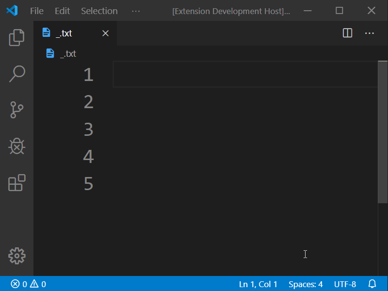
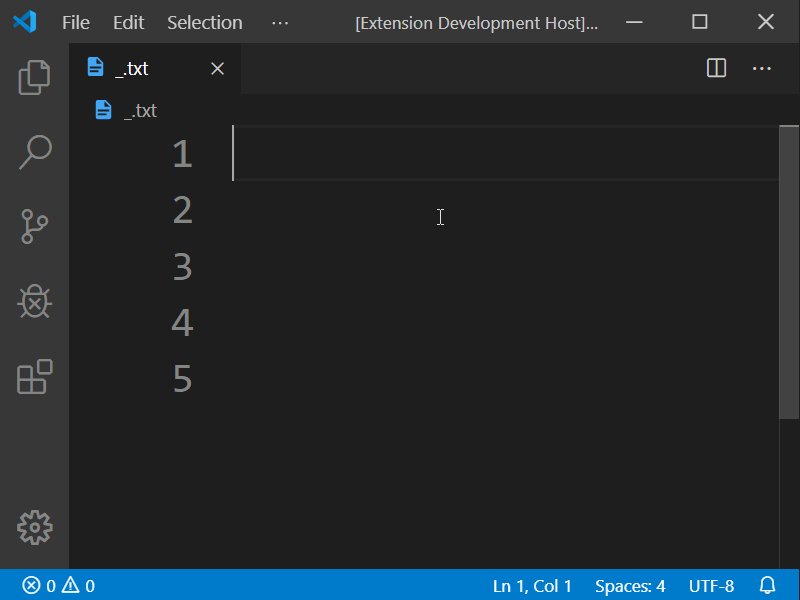
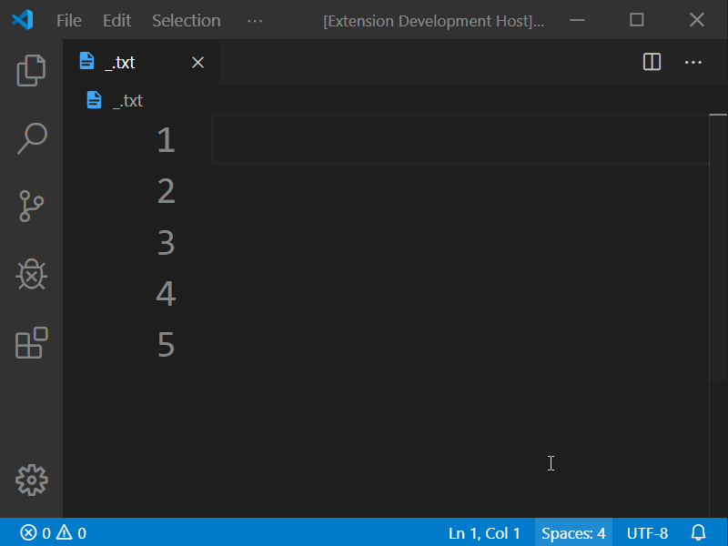
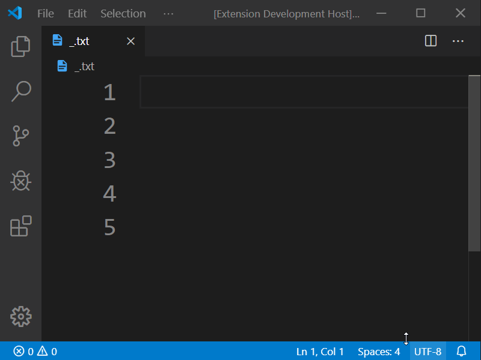

# selects README

## Features
- Increment number on selections (ascending / descending / selected order)
- Insert string on selections

### Insert

### Increment

### Increment Ascending

### Increment Descending

## Requirements

## Extension Settings
Trailing: Trail after increment or insert. Default: ' ' (whitespace)

## Known Issues

## Release Notes
See changelog.md

-----------------------------------------------------------------------------------------------------------